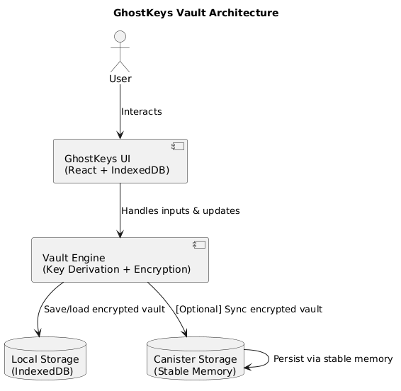

# 👻 GhostKeys.app

**Zero-Friction Vault for Secrets. Decentralized. Secure. Effortless.**

`ghostkeys.app` is a zero-friction vault for developers and everyday users to manage secrets with security and simplicity, leveraging decentralization to reduce costs, enhance privacy, and increase reliability.

Built on the Internet Computer Protocol (ICP), GhostKeys offers an ultra-lightweight experience with no logins, no server dependencies, and full client-side encryption. Our goal: replace painful Web2 infra with trustless, usable Web3 primitives.

---

## 🚀 Vision
We’re building the **invisible glue for modern Web3 and Web2 hybrid infrastructure** — replacing traditional infra components like:

- 🔑 Secrets Managers (GCP, AWS, Bitwarden)
- 🔐 Corporate Password Vaults (LastPass, Bitwarden, 1Password)
- 🛡️ Gateway Auth (API Keys, Rotations, SSO, etc.)
- ⚙️ Config-as-a-Service (Environment & access config with zero DevOps friction)

All powered by client-side cryptography, decentralized storage, and the **unique HTTP request capabilities** of the Internet Computer.


### 🤖 AI-Agent Friendly by Design

GhostKeys is built to **safely interface with autonomous agents** — whether LLMs, bots, or local copilots — without compromising data security.

We recognize that AI agents can be powerful tools for automation, but also introduce **unintentional data exposure risks** when interacting with unstructured or plaintext databases. To address this, GhostKeys makes the following guarantees:

- 🔐 **Always Encrypted**: Any data input or modified by AI agents is encrypted on the client before leaving the environment — no plaintext is ever stored or transmitted.
- 🧠 **Agent-Usable Vaults**: Agents can read and write to vaults without requiring access to underlying encryption keys — they operate through secure local APIs.
- 🧾 **Structured Secrets Templates**: Designed to guide agents toward predictable formats (e.g., API keys, tokens, configs) to reduce hallucination and data loss.
- 🧩 **Composable Access**: Agents can embed GhostKeys as a secure memory module within broader workflows without altering core vault logic.

GhostKeys serves as the **"secure memory layer"** for local or cloud-based agents. Whether auto-filling credentials, rotating secrets, or storing environment configs — your vault remains agent-accessible but never agent-compromised.

---

## ✨ Key Features

- 🔐 **Client-Side Encryption**: All secrets encrypted before leaving your device
- 🧠 **Mnemonic-Free Identity**: Auth via wallet signature or ephemeral key
- 📁 **Vault Templates**: Create structured secrets for apps, APIs, infra configs
- ⛓️ **Offline-First**: Operates fully offline with optional sync
- 🧩 **Composable**: Drop-in iFrame or SDK for developers to embed secrets
- 🌐 **Decentralized Storage**: Internet Computer provides zero-cost hosting
- 👥 **Multi-profile Support**: Manage multiple vaults or org contexts
- 🖱️ **Instant UX**: No login, no setup, just land and start typing

---

## 📦 Architecture


---

## 🛤️ Roadmap

### ✅ Phase 1: MVP (Complete or Nearing Complete)
- [x] Local-first vault with table UI (structured entry grid)
- [x] Create/edit/delete vaults and rows
- [x] Add/remove columns, with secret/plain toggle
- [x] Removed Phantom wallet auth from prev version
- [x] Deployable on local DFX

### 🛠️ Phase 2: Zero-Friction UX & Personal Canister Sync
- [ ] Add optional Internet Identy identity
- [ ] Derive per-user keys from signatures (not seed phrases)
- [ ] Stable memory for vault state (canister-per-user model)
- [ ] Instant auto-save to IndexedDB
- [ ] Optional: sync button for canister upload/download

### 📦 Phase 3: Developer Templates & SDK
- [ ] Template gallery: SSH config, API keys, JWT sets, etc.
- [ ] Embed GhostKeys into other apps via iFrame or SDK
- [ ] CLI tool for CI/CD secrets usage
- [ ] Vault export/import with optional encryption key
- [ ] Full AI agent integration

### 🧑‍💼 Phase 4: Corporate & Team Vaults
- [ ] Role-based access control (RBAC)
- [ ] Vault sharing and team invites
- [ ] Audit logs (locally stored)
- [ ] Template for rotating credentials

### 🧠 Phase 5: Smart Agents & AI Ops
- [ ] Local LLM for vault analysis (“you’re missing an SSH key for server X”)
- [ ] Agent-assisted secret population from dev environments

---

## 🧪 Quick Start

### Prerequisites

- [Node.js](https://nodejs.org/) (v16+)
- [Rust](https://www.rust-lang.org/tools/install)
- [DFX SDK](https://internetcomputer.org/docs/current/developer-docs/setup/install/)
- [`candid-extractor`](https://github.com/dfinity/candid-extractor):
### Setup

```bash
git clone <repo>
cd ghostkeys.app
npm install

# Terminal 1
dfx start --clean --background

# Terminal 2
dfx deploy
```

---

## 🛡️ Security Principles

- 🔒 Secrets encrypted before leaving device
- 🔑 Keys derived from secure wallet signature or ephemeral auth
- 🧾 No emails, no passwords, no user data stored
- 🔁 Stateless, serverless: no centralized control or risk

---
