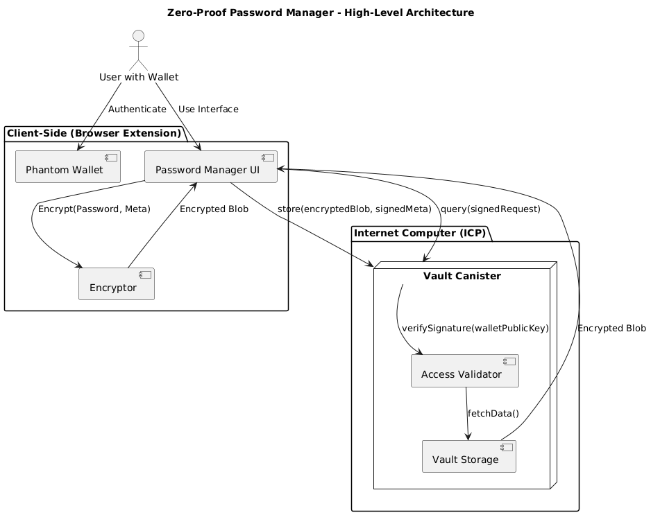

# 🔐 Zero-Proof Vault

A secure, decentralized Vault built on the Internet Computer with zero-knowledge cryptography and Phantom Wallet integration.

## ✨ Features

- 🔐 **Zero-Knowledge Encryption**: Your passwords are encrypted client-side before being stored
- 🌐 **Decentralized Storage**: Built on the Internet Computer blockchain
- 👛 **Phantom Wallet Integration**: Secure authentication with Solana wallet
- 📁 **CSV Import**: Import passwords from existing CSV files
- 🎨 **Modern UI**: Beautiful blockchain-themed interface
- 🔒 **Client-Side Encryption**: Your data never leaves your device unencrypted

## Architecture (POC)


## 🚀 Quick Start

### Prerequisites

- [Node.js](https://nodejs.org/) (v16 or higher)
- [DFX](https://internetcomputer.org/docs/current/developer-docs/setup/install/) (Internet Computer SDK)
- [Phantom Wallet](https://phantom.app/) browser extension

### Installation

1. **Clone the repository**
   ```bash
   git clone <repository-url>
   cd zero-proof-pw-manager
   ```

2. **Install dependencies**
   ```bash
   npm install
   ```

3. **Start the development environment**

   **Terminal 1 - Start DFX (Internet Computer)**
   ```bash
   dfx start --clean --background
   ```

   **Terminal 2 - Deploy the backend**
   ```bash
   dfx deploy
   ```

   **Terminal 3 - Start the frontend**
   ```bash
   cd src/zero-proof-pw-manager-frontend
   npm run dev
   ```

4. **Open your browser**
   - Navigate to `http://localhost:3000`
   - Connect your Phantom Wallet
   - Start managing your passwords securely!

## 🛠️ Development

### Project Structure

```
zero-proof-pw-manager/
├── src/
│   ├── zero-proof-pw-manager-backend/    # Internet Computer backend (Motoko)
│   └── zero-proof-pw-manager-frontend/   # React frontend
├── dfx.json                              # DFX configuration
└── package.json                          # Root package configuration
```

### Available Scripts

**Root directory:**
- `npm install` - Install all dependencies
- `npm run build` - Build all packages
- `npm start` - Start the frontend development server

**Frontend directory (`src/zero-proof-pw-manager-frontend/`):**
- `npm run dev` - Start development server on port 3000
- `npm run build` - Build for production
- `npm run setup` - Setup and deploy to Internet Computer

**DFX commands:**
- `dfx start` - Start local Internet Computer replica
- `dfx deploy` - Deploy canisters to local network
- `dfx deploy --network ic` - Deploy to mainnet

### Technology Stack

- **Frontend**: React 18, Vite, TypeScript, SCSS
- **Backend**: Motoko (Internet Computer)
- **Wallet**: Phantom Wallet (Solana)
- **Encryption**: Client-side AES encryption
- **Styling**: Modern CSS with blockchain theme

## 🔧 Configuration

### Environment Variables

Create a `.env` file in the root directory:

```env
# Internet Computer Network (local or ic)
DFX_NETWORK=local

# Frontend port
VITE_PORT=3000
```

### DFX Configuration

The `dfx.json` file configures the Internet Computer canisters:

```json
{
  "canisters": {
    "zero-proof-pw-manager-backend": {
      "main": "src/zero-proof-pw-manager-backend/main.mo",
      "type": "motoko"
    },
    "zero-proof-pw-manager-frontend": {
      "dependencies": ["zero-proof-pw-manager-backend"],
      "source": ["src/zero-proof-pw-manager-frontend/dist"],
      "type": "assets"
    }
  }
}
```

## 🎨 UI Features

### Modern Design
- **Blockchain Theme**: Cyberpunk-inspired design with gradients and animations
- **Responsive Layout**: Works on desktop, tablet, and mobile
- **Dark Mode**: Easy on the eyes with high contrast
- **Smooth Animations**: Loading states and transitions

### User Experience
- **Intuitive Navigation**: Clear paths between wallet connection and password management
- **Real-time Feedback**: Status indicators and progress bars
- **Error Handling**: Graceful error messages and recovery
- **Accessibility**: Keyboard navigation and screen reader support

## 🔐 Security Features

### Zero-Knowledge Architecture
- **Client-Side Encryption**: All encryption happens in your browser
- **Vault Key Derivation**: Keys derived from your wallet signature
- **No Plaintext Storage**: Passwords are never stored unencrypted
- **Decentralized Storage**: Data stored on Internet Computer blockchain

### Privacy Protection
- **No Personal Data**: No email, phone, or personal information required
- **Wallet-Based Identity**: Authentication through your Phantom Wallet
- **Local Processing**: All sensitive operations happen locally
- **No Tracking**: No analytics or tracking scripts

## 🚀 Deployment

### Local Development
```bash
# Terminal 1: Start DFX
dfx start --clean --background

# Terminal 2: Deploy backend
dfx deploy

# Terminal 3: Start frontend
cd src/zero-proof-pw-manager-frontend
npm run dev
```

### Production Deployment
```bash
# Deploy to Internet Computer mainnet
dfx deploy --network ic

# Build and deploy frontend
cd src/zero-proof-pw-manager-frontend
npm run build
dfx deploy --network ic
```

## 🤝 Contributing

1. Fork the repository
2. Create a feature branch (`git checkout -b feature/amazing-feature`)
3. Commit your changes (`git commit -m 'Add amazing feature'`)
4. Push to the branch (`git push origin feature/amazing-feature`)
5. Open a Pull Request

## 🆘 Support

- **Documentation**: Check the code comments and this README
- **Issues**: Report bugs on GitHub Issues

## 🙏 Acknowledgments

- Internet Computer Foundation for the blockchain infrastructure
