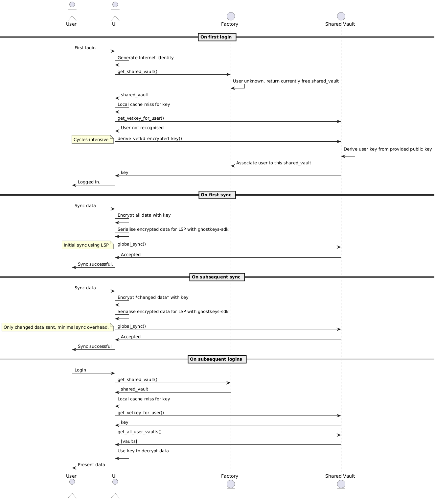

# GhostKeys.app

> **Decentralized. Client‑encrypted. Effortless.**
> Built on the Internet Computer Protocol (ICP), GhostKeys lets humans and machines store secrets with **no logins**, **no servers**, and **no plaintext ever leaving your device**.

---

## Table of Contents

- [GhostKeys.app](#ghostkeysapp)
  - [Table of Contents](#table-of-contents)
  - [What is GhostKeys?](#what-is-ghostkeys)
  - [Core Architecture](#core-architecture)
    - [Factory Canister](#factory-canister)
    - [Vault Canister](#vault-canister)
    - [Frontend (this repo)](#frontend-this-repo)
    - [High-Level call diagrams](#high-level-call-diagrams)
      - [Shared Vault Canister](#shared-vault-canister)
      - [Factory Canister](#factory-canister-1)
  - [Lean Serial Protocol](#lean-serial-protocol)
  - [Security Model](#security-model)
    - [1) Account Identity (seed → Ed25519 → Principal)](#1-account-identity-seed--ed25519--principal)
    - [2) VaultKey Derivation (static, user-bound)](#2-vaultkey-derivation-static-user-bound)
    - [3) vetKD Key Derivation (fresh, scoped, on-chain assisted)](#3-vetkd-key-derivation-fresh-scoped-on-chain-assisted)
    - [4) Final Encryption Key (HKDF mix of VaultKey + VetKey)](#4-final-encryption-key-hkdf-mix-of-vaultkey--vetkey)
    - [5) Encryption](#5-encryption)
    - [6) Decryption](#6-decryption)
    - [Invariants](#invariants)
  - [Data Model (Vault)](#data-model-vault)
  - [Quick Start (Local Dev)](#quick-start-local-dev)
    - [Prerequisites](#prerequisites)
    - [Run](#run)
  - [Configuration](#configuration)
    - [DFX \& Remote Artifacts](#dfx--remote-artifacts)
    - [Frontend Actor Bootstrapping](#frontend-actor-bootstrapping)
  - [What’s New / Changes](#whats-new--changes)
  - [Roadmap](#roadmap)
  - [License](#license)

---

## What is GhostKeys?

GhostKeys is a **universal secrets vault** for both people and programs:

* **Client‑side encryption by default**: the UI encrypts everything before it ever touches the network.
* **Zero friction**: land on the app and start typing; optional sync to the ICP later.
* **Scales from solo to enterprise**: free‑tier users share a multi‑tenant canister; premium users get **canister‑per‑user** isolation.
* **Agent‑friendly**: designed so local or hosted AI agents can read/write **without ever receiving raw keys**.

> For a feature‑oriented overview and historical context, see updated **[CHANGELOG](./CHANGELOG.md)**.

---

## Core Architecture

GhostKeys is split into three logical parts:

### Factory Canister

* **Entry point** for the whole system. Frontend talks to Factory first.
* **Spawns** new **dedicated Vault canisters** for premium users and **provides access** to a pre‑created **Shared Vault canister** for free tier.
* Pulls Vault and Shared‑Vault **WASM/DID artifacts from GitHub Releases** at build time (via a shell script) instead of embedding binaries.
* Repo: **[https://github.com/Ghostkeys-App/factory-canister](https://github.com/Ghostkeys-App/factory-canister)**

### Vault Canister

* Stores **only ciphertext and minimal metadata** for:

  * Website logins (sites → entries of key/value pairs)
  * Secure notes (title, ciphertext body)
  * Flexible grid (spreadsheet semantics; per‑column `secret/plain` hint)
* Uses stable memory (`ic-stable-structures`) and is upgrade‑friendly.
* Supports vetKD flows for **verifiable encryption to derived keys**.
* Repo: **[https://github.com/Ghostkeys-App/vault-canister](https://github.com/Ghostkeys-App/vault-canister)**

### Frontend (this repo)

* React/TypeScript UI with an **offline‑first** model (IndexedDB) and **optional sync** to the ICP.
* **Actor bootstrap is factory‑first**; the Factory reveals IDs for Vault/Shared‑Vault and the UI then creates those actors.
* UX modules include **Website Logins**, **Secure Notes**, **Spreadsheet**, and **Profile/Seed** flows.

### High-Level call diagrams

#### Shared Vault Canister


#### Factory Canister


---

## Lean Serial Protocol

* A purpose-built message format for **ultra-fast syncs**.
* Only send **changed data**, ensuring minimal overhead.
* **Ghostkeys SDK** provides dedicated data structures and serializers for easy frontend integration.

---

## Security Model

This section explains how GhostKeys derives identities and keys and how it encrypts/decrypts data. **All cryptography happens client-side; only ciphertext and public parameters ever touch the network.**

### 1) Account Identity (seed → Ed25519 → Principal)

**Mnemonic**
Generate a BIP-39 mnemonic using the 2048-word English list, 128-bit entropy → 12 words.

**Seed material (64 bytes)**
Apply a KDF to the mnemonic to obtain a deterministic 64-byte seed (IKM).

**Deterministic private key (SLIP-0010)**
Derive a key using SLIP-0010 with path `m/44'/223'/0'/0'/0'` from the 64-byte IKM.

**Identity (Ed25519)**
Convert the derived secret to an Ed25519 keypair and produce the ICP Principal from the public key.

On login, the same mnemonic deterministically reproduces the same identity. The mnemonic is never stored or transmitted.

### 2) VaultKey Derivation (static, user-bound)

Derive a per-user **VaultKey** that is stable across sessions:

* Compute/obtain a vault public key using the same SLIP-0010 strategy as identity (or a designated vault path).
* Concatenate an application salt with the vault public key and hash with SHA-256:

```text
VaultKey := SHA256( SALT || vault_public_key_bytes )  // 32 bytes
```

### 3) vetKD Key Derivation (fresh, scoped, on-chain assisted)

Obtain a second key using DFINITY’s verifiable encryption to derived keys (**vetKD**):

* **Scope:** default is `PerUser`, using the caller’s Principal.
* **Input:** build a context string

```text
ctx = "SALT:ID:PURPOSE:ROTATION_ID"
input32 := SHA256( utf8(ctx) )  // 32 bytes
```

* **Transport keypair:** generate cryptographic randomness (e.g., via the vetKD/DFINITY randomness flow) and derive an ephemeral transport keypair; keep the private part client-side, send the `transport_public_key`.
* **Request:** send `{ scope, input: input32, transport_public_key }` to the canister.
* **On-chain derivation:** the canister derives key material under the given scope using BLS12-381 G2 and returns it **encrypted** to your `transport_public_key`.
* **Client decrypt:** decrypt the response with your transport private key to yield:

```text
VetKey  // 32 bytes
```

`ROTATION_ID` enables key rotation without changing identity (increment to rotate `VetKey`).

### 4) Final Encryption Key (HKDF mix of VaultKey + VetKey)

Mix both keys into the single key used for data encryption:

**Salt:**

```text
finalSalt := SHA256( VAULT_SALT || USER_SALT )
```

**HKDF (SHA-256):**

```text
IKM := VaultKey || VetKey              // deterministic concatenation
PRK := HKDF-Extract(finalSalt, IKM)
FinalKey := HKDF-Expand(PRK, info="ghostkeys/v1/aes-gcm", L=32)  // 32 bytes (AES-256)
```

### 5) Encryption

* **Algorithm:** AES-256-GCM with a 12-byte (96-bit) random nonce per message.
* **Input:** UTF-8 plaintext.
* **Output:** `{ nonce(12), ciphertext, auth_tag(16) }`.
* **Encoding:** store/transport as Base64 (or Base64-URL) fields.
* **Optional AAD:** include stable metadata (e.g., user principal, record type) as AAD to bind ciphertext to context.

**Nonce uniqueness is critical:** never reuse a `(FinalKey, nonce)` pair.

### 6) Decryption

Re-derive `FinalKey` from the mnemonic (or logged-in identity) → verify GCM tag → decrypt using the stored nonce and recover the plaintext.

### Invariants

* No plaintext ever leaves the client.
* Canisters store only ciphertext, nonces, tags, and public parameters.
* Keys are never logged or persisted in plaintext; rotation is achieved via `ROTATION_ID` and/or salts.
* All derivations are deterministic from the seed + context, so users can recover access from their mnemonic alone.

---

## Data Model (Vault)

A high‑level sketch (see the Vault repo for the authoritative Candid):

```text
VaultData {
  vault_name: text
  website_logins: vec { (site_name: text, entries: vec { (k: text, v: text) }) }
  secure_notes: vec { (title: text, body_ciphertext: text) }
  flexible_grid_columns: vec { (label: text, (index: nat32, is_secret: bool)) }
  flexible_grid: vec { ((row: nat32, col: nat32), cell_ciphertext: text) }
}
```

> UI encrypts per‑field using AES‑GCM (or equivalent) derived from seed/vetKD; the canister validates types and persists opaque blobs.

---

## Quick Start (Local Dev)

### Prerequisites

* Node.js (LTS), Rust toolchain, **DFX ≥ 0.17**
* Rust target:

```bash
rustup target add wasm32-unknown-unknown
```

### Run

```bash
# 1) Clone and install
git clone https://github.com/Ghostkeys-App/ghostkeys-app.git
cd ghostkeys-app
npm install

# 2) Start replica
dfx start --clean --background

# 3) Deploy (factory + frontend, depending on workspace)
dfx deploy
```

After deploy, ensure your environment exposes the **Factory canister ID**. Many setups export `CANISTER_ID_FACTORY_CANISTER_BACKEND`, which the frontend uses to create the first actor.

---

## Configuration

### DFX & Remote Artifacts

We rely on **remote release artifacts** (WASM/DID) so local repos can stay lightweight. In `dfx.json` for custom canisters, you’ll typically see entries like:

```json
{
  "canisters": {
    "factory-canister-backend": {
      "type": "custom",
      "wasm": "https://github.com/Ghostkeys-App/factory-canister/releases/download/<TAG>/factory_canister_backend.wasm",
      "candid": "https://github.com/Ghostkeys-App/factory-canister/releases/download/<TAG>/factory-canister-backend.did",
      "metadata": [{ "name": "candid:service" }],
      "post_install": ["dfx generate factory-canister-backend"]
    }
  }
}
```

> The Factory repo includes a helper script, `scripts/fetch_vault_release.sh`, which **downloads the latest Vault/Shared‑Vault WASM/DID** from the Vault repo’s releases and falls back to generating DIDs via `candid-extractor` if missing. You can override the default release tag with `VAULT_RELEASE_TAG=<tag>`.

### Frontend Actor Bootstrapping

Frontends should **always** create the Factory actor first, then discover other IDs:

```ts
// sketch
const factory = await getFactoryCanisterAPI();
const { sharedVaultId, userVaultId } = await factory.get_shared_vault_or_user_vault(...);
const sharedVault = createActor(sharedVaultId);
const userVault   = createActor(userVaultId);
```

The UI will keep a **single source of truth** in a Vault context (IndexedDB‑backed) and expose actions like `saveToIdb`, `syncFromIc`, and `reloadFromIc`. A **Reload** button in the sidebar stays disabled until the vault exists on chain.

---

## What’s New / Changes

A detailed, commit‑grouped summary (UI/UX, state/IDB, IC integration, crypto, and policies) is maintained in **[CHANGELOG.md](./CHANGELOG.md)**.

---

## Roadmap

**Phase 1: MVP (Complete)**

* Local‑first vault with structured grid
* Create/edit/delete rows and columns (secret/plain)
* Deployed on local DFX

**Phase 2: Zero‑Friction UX & Personal Canister Sync (Complete)**

* New UI and Zero-Friction UX
* Factory canister for vault management
* Derive per‑user keys from signatures
* Stable memory in per‑user canisters
* Auto‑save to IndexedDB; manual sync button

**Phase 3: Developer Templates & SDK**

* Template gallery, iFrame/SDK, CLI, import/export, agent integration

**Phase 4+: Teams & Enterprise**

* RBAC, sharing, audit logs, rotation templates; agent‑assist ops

---


## License

TBD (proprietary while pre‑launch).
